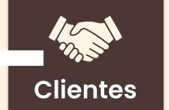

# GestorDeHoras 🕒

Management System to track developers worked hours.

[Deployed App](https://horarios.matiabossio.com.ar/) | [Backend Repository](https://github.com/Agrossio/GestionHorariosBackend) | [API Docs](https://pokechallenge.matiabossio.com.ar:445/swagger-ui/#/)

- Test users:
  - admin@mail.com
  - management@mail.com
  - developer@mail.com
  

- Test Password (for all users): Masterpass123

## Features 📋

### 3 user roles
- Admin: 👮
  - Approve new users
  - Set user roles
  - Create Projects
  - Create Clients
  - Create Tasks
  - Create Sprints
  - Assign Developer to a project/task
  - Add/remove work days in calendar

- Management: 📈
  - View project KPIs
  - Download project report in pdf.

- Developer: 👨‍🔧
  - View assigned projects
  - Get a task
  - Change task status

### Spring Security

## Developers Team 💻 

### Frontend Team 🖼️
- [Maria Jose Pappalardo](https://www.linkedin.com/in/majopappalardo/)
- [Ricardo Emiliano Farias Castillo](https://www.linkedin.com/in/refc/)
- [Denise Carla María Cardozo](https://www.linkedin.com/in/denise-carla-maria-cardozo/)
- [Fernando Mesa](https://www.linkedin.com/in/fernando-mesa-673b54162/)
- [Lucas Sansberro](https://www.linkedin.com/in/lucas-sansberro/)

### Backend Team ⚙️
- [Diego Agudo](https://www.linkedin.com/in/agudodiego/)
- [Laureano Marenco](https://www.linkedin.com/in/laureano-marenco/)
- [Cecilia Diaz Ortigoza](https://www.linkedin.com/in/ceciliadiazortigoza/)
- [Alvaro Atencio](https://www.linkedin.com/in/alvaro-atencio/)
- [David Mariano Suter](https://www.linkedin.com/in/david-suter/)
- [Matias Abossio](https://www.linkedin.com/in/matiasabossio/)

## UI 🎨

### Pages

Login and register

User profile (Role admin in this example)

List pages (Projects in this example)

Project detail

Project admin view

Client detail

### Components

Accept or reject box

Button

Calendar input

Client icon navbar (Improves readability when using ng If)

Project icon navbar (Improves readability when using ng If)

User icon navbar (Improves readability when using ng If)

Create or edit modal (Client in this example)

Detail box

Navbar (View by admin in this example)

Password input

Reported alerts modal

Search container

Simple input

Simple modal

Task detail users

User application modal

